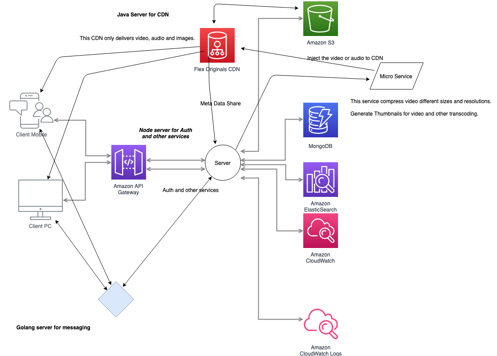
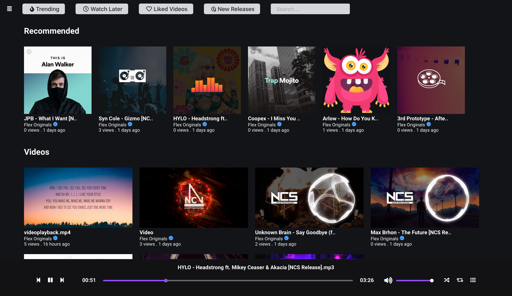

  

 

<h2 align="center">Flex Originals</h2>

<a href="https://youtu.be/z9oHNzA4pTk">Demo</a>

<h2 align="center">Architecture of project</h2>

  

  

**Flex Originals** is an **opensource** project. Contributions are welcome

# Features
 
-   🤟 **No Bootstrap Components Frameworks** - Written in **Vue.js** for client and **React.js** for admin and own design scss styles.
-   📼 **Video & Audio & Image** - Share your video, audio and images.
-   💪 **Accessible** - full support for VTT captions and screen readers
-   🔧 **[Theme](#html)** - Dark and Light theme.
-   😎 **Clean HTML** - uses the _right_ elements. `<input type="range">` for volume and `<progress>` for progress and well, `<button>`s for buttons. There's no
    `` or `<a href="#">` button hacks
-   📱 **Responsive** - works with any screen size
-   💵 **[Monetization](#ads)** - make money from your videos
-   📹 **[Streaming](#demos)** -  streaming playback
-   🎛 **[API](#api)** - toggle playback, volume, seeking, and more through a standardized API
-   🔎 **[Fullscreen](#fullscreen)** - supports native fullscreen with fallback to "full window" modes
-   ⌨️ **[Shortcuts](#shortcuts)** - supports keyboard shortcuts
-   🖥 **Picture-in-Picture** - supports picture-in-picture mode
-   📱 **Playsinline** - supports the `playsinline` attribute
-   🏎 **Speed controls** - adjust speed on the fly
-   📖 **Multiple captions** - support for multiple caption tracks
-   👌 **[Preview thumbnails](#preview-thumbnails)** - support for displaying preview thumbnails 
-   💁‍♀️ **SASS** - to include in your build processes

# Road Map

1. Improve UI
2. Improve Server
3. Improve CDN
4. Improve Players Video & Audio
5. Add redis
6. Add video and audio processing.
7. Make distributed server.

# Project Setup & Scripts

1. ffmpeg
2. Ngnix Server
3. Docker & Compose
4. MongoDB

You can run the following scripts with `yarn` or `npm` like `yarn install`

| Script       | Description                                          |
| ------------ | ---------------------------------------------------- |
| `install`    | Project setup                                        |
| `dev`        | Compile and start development server with hot-reload |
| `build`      | Compile and minify for production                    |
| `prod`       | Start production server                              |
| `lint`       | Run eslint for the entire project                    |
| `test`       | Run all tests                                        |
| `test:watch` | Start tests in watch mode                            |
### Project Setup
### Node
- Node installation on Windows
  Just go on [official Node.js website](https://nodejs.org/) and download the installer.
Also, be sure to have `git` available in your PATH, `npm` might need it (You can find git [here](https://git-scm.com/)).
- Node installation on Ubuntu
  You can install nodejs and npm easily with apt install, just run the following commands.
      `$ sudo apt install nodejs`
      `$ sudo apt install npm`
- Other Operating Systems
  You can find more information about the installation on the [official Node.js website](https://nodejs.org/) and the [official NPM website](https://npmjs.org/).
If the installation was successful, you should be able to run the following command.M 
    `$ node --version`

    `$ npm --version`
If you need to update `npm`, you can make it using `npm`! Cool right? After running the following command, just open again the command line and be happy. 
    `$ npm install npm -g`
### MongoDB Project Setup
Follow this to install MongoDB in your computer.

[official MongoDB website ](https://docs.mongodb.com/manual/installation/)

> INSTALLING COMPASS
 - You can install compass using the install_compass script packaged with MongoDB: 
    `$ ./install_compass`
  This will download the appropriate MongoDB Compass package for your platform
  and install it.
### FFmpeg Project Setup
- Download a static build.
- Use 7-Zip to unpack it in the folder of your choice.
- Open a command prompt with administrator's rights.
<b>NOTE: Use CMD.exe, do not use Powershell!</b> The syntax for accessing environment variables is different from the command shown in Step 4 - running it in Powershell will overwrite your System PATH with a bad value.
- Run the command (see note below; in Win10, you might want to use the Environmental Variables area of the Windows Control Panel to update PATH):
`setx /M PATH "path\to\ffmpeg\bin;%PATH%"`.Do not run setx if you have more than 1024 characters in your system PATH variable.
- Installing FFmpeg in Ubuntu   
`sudo apt-get update`  
`sudo apt-get install ffmpeg` 
`sudo apt-get install frei0r-plugins`  

### Contributing 
- Open issues :boom:
- Raise PRs for issues :raised_hand:
- Fork the repo and star it :star: 
	
- Clone the repo :
	`https://github.com/NJACKWinterOfCode/flex-originals.git` 
- Run :
	`npm install`
- To start development mode run:
	`npm run dev`
- For production run in docker `sudo docker-compose up --build -d` with nginix server to reverse proxy to ports use this [settings](https://github.com/NJACKWinterOfCode/flex-originals/blob/feature/scripts/default).

Copyright (c) 2019, Anurag Kumar [Anurag Kumar](http://github.com/anu1601cs/)
