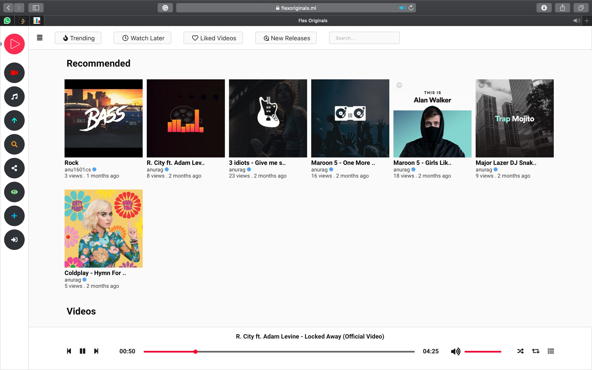

  

<!--  -->

  <!--  -->
  <!--  -->

 

<h2 align="center">Flex Originals</h2>

<a href="https://youtu.be/z9oHNzA4pTk">Demo</a>

  

<h2 align="center">Architecture of project</h2>

  

**Flex Originals** is an **opensource** project. Contributions are welcome

**Road Map**

1. Improve UI
2. Improve Server
3. Improve CDN
4. Improve Players Video & Audio
5. Add redis
6. Add video and audio processing.
7. Make distributed server.

## Project Setup & Scripts

1. ffmpeg
2. Ngnix Server
3. Docker & Compose

You can run the following scripts with `yarn` or `npm` like `yarn install`

| Script       | Description                                          |
| ------------ | ---------------------------------------------------- |
| `install`    | Project setup                                        |
| `dev`        | Compile and start development server with hot-reload |
| `build`      | Compile and minify for production                    |
| `prod`       | Start production server                              |
| `lint`       | Run eslint for the entire project                    |
| `test`       | Run all tests                                        |
| `test:watch` | Start tests in watch mode                            |

- Fork the repo and star it :star:
- Open issues :boom:
- Raise PRs for issues :raised_hand:
- Help on documentation :page_facing_up:

Copyright (c) 2019, Anurag Kumar [Anurag Kumar](http://github.com/anu1601cs/)
